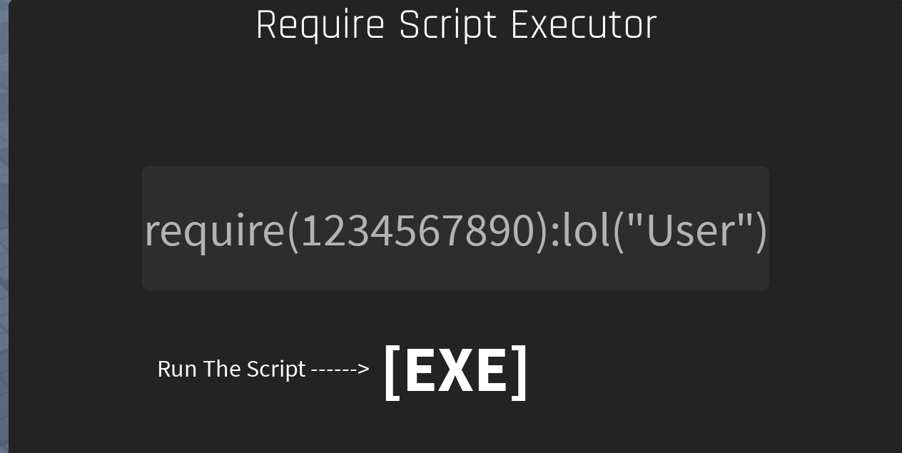

# Free SS Executor GUI

A free Roblox script executor GUI made by **LunarPulse0**.  

---

## Features

- Easy-to-use GUI
- Script Execution Working In 2025 :O

---

## Setup

1. Put the **vLua Module** and **RemoteEvent 'ExecuteScript'** in **ReplicatedStorage**.  
2. Place the main script (`Place Me In ServerScriptService :D`) in **ServerScriptService**.  
3. Add the **ScreenGui** to **StarterGui**.  
4. Done! You can toggle the credits with the `Enable?` BoolValue.

Still confused? Just enable it and let the script handle the rest.

---

## Download

You can download the GUI from the [Releases](https://github.com/lunry0/Roblox-ServerSide-Executor/releases).

---

## Screenshots

  

---

## Credits

- **LunarPulse0** – Creator of Free SS Executor GUI  
  [Profile](https://www.roblox.com/users/7208746866/profile)  

- **vLua** – Loadstring reimplemented in Lua  
  Created by **Reinitialized**  
  [vLua Asset](https://create.roblox.com/store/asset/4689019964/vLua-Loadstring-reimplemented-in-Lua)  
  [Reinitialized Profile](https://www.roblox.com/users/189503/profile)  
